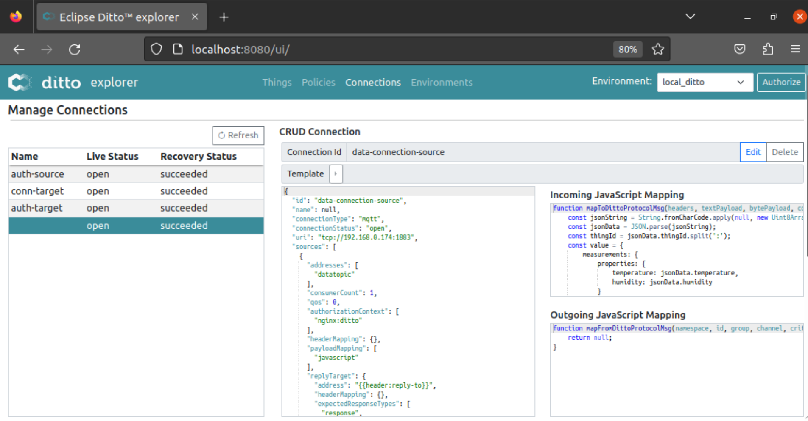
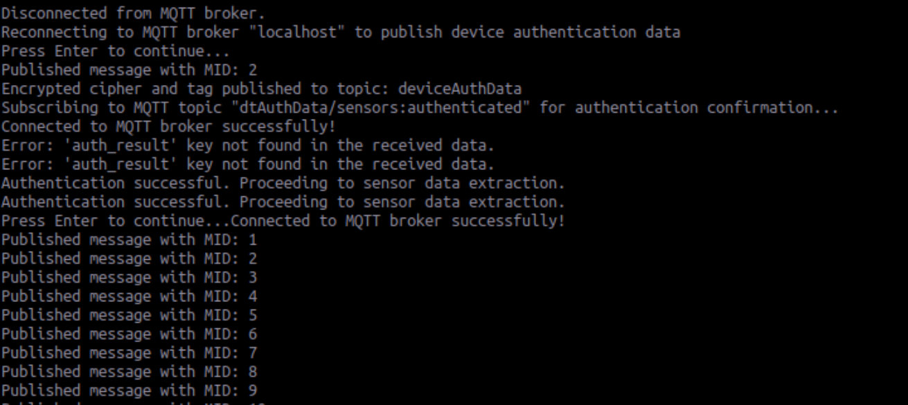

# A TinyJAMBU lightweight Authenticated Encryption Scheme to authenticate IoT Devices and their  Digital Twins in Eclipse Ditto 

This repository is part of my Bachelor's Thesis in Computer Science, supervised by Dr. Prof. Elhajj Mohamed at Constructor University Bremen. 

---

 
## Problem statement: 
Based on the detailed study of IoT and Digital Twins technologies presented in my thesis, it is obvious that one of the main challenges facing the IoT environment, and more recently Digital Twin-based IoT environment, is security. In brief, the main reason behind this is the weak computational and memory power of IoT nodes, the lack of standardization in communication and security protocols and the strong heterogeneity of IoT environments. As a result and as showcased in my research, many IoT devices, Digital Twins environments and others are deployed to the consumer while lacking basic security requirements making the data and the system as a whole weak and vulnerable against attacks and malicious usage. Please refer to my thesis paper for a detailed explanation. Thus, the goal of my project is to provide a novel mechanism that is compatible with constrained environments to ensure the authentication of IoT devices and their adjacent digital counterpart. 

## Project description: 
This project aims at providing a novel authentication scheme to authenticate IoT devices and their Digital Twins implemented in Eclipse Ditto. The authentication scheme is based on the lightweight Authentication Encryption algorithm that is TinyJAMBU. The algorithm is implemented using Python and the communication is ensured through a Mosquitto MQTT broker, configured properly to use TLS/SSL (for more security), and deployed in the IoT environment in a Raspberry Pi 3 Model A+. A Web Application is also implemented that serves as the UI that presents the live state of the sensor using its digital twin, but also serves to manage the digital twin, the incoming and ongoing messages and to showcase the authentication mechanism itself. The web application is a complete web page that uses the Ditto API. More information about Ditto API is here.  

>> IMPORTANT NOTE: in the following installation guide I assume that users are familiar with all the abstractions that Eclipse Ditto uses in order to represent digital twins, and manage authorizations and connections. For a detailed explanation please refer to the official documentation here.    


## Prerequisites:
#### Hardware prerequisite: 
1. Local machine running the digital twin (Ubuntu 20.04 in my case),
2. Raspberry Pi (I used a model 3 A+) connected to the same WIFI as the local machine and accessible via SSH,   
3. A DH11 temperature and humidity sensor connected to the appropriate GPIO of the Raspberry. 

#### Software prerequisite: 
1. Eclipse Ditto is installed on the local machine. 
2. Eclipse Mosquitto broker and clients installed in the Raspberry Pi and the local machine.
3. Python3.x, JDK 8 >= 1.8.0_92, Apache Maven 3.x, a running Docker daemon and Docker Compose installed in the local machine. 
4. Python3.x installed in the Raspberry Pi.
## Directory structure: 
```bash
.
├── TinyJAMBU/        #TinyJAMBU implementation directory
│   ├── TinyJAMBU.py  #Main implementation file, contain both encrypt() and decrypt() fucntions
│   ├── utility.py    #Basic utility functions used by tinyjambu 
│   ├── methods.py    #Main methods used by the tinyJAMBU algorithm, implemented following the official paper documentation. 
│   ├── AuthenticationTwinSide.py   #Main Python code that decrypts received cipher and confirms or denies authentication.
│   ├── data_conn_source.json  #Configuration file to create a connection source for state update   
│   └── data_conn_target.json  #Configuration file to create a connection target for state update 
├── TLS/        #TinyJAMBU implementation directory
│   ├── tls.sh #script to generate necessary files to enable TLS/SSL over MQTT using self-signed certificates
│   ├── ca.crt    #certificate authority certificate 
│   └── server.crt #server certificate
├── Webapp/           #Web application directory 
│   ├── node_modules/ 
│   ├── index.js      #Main web application code
│   ├── index.html    #HTML of the web application 
│   ├── package-lock.json
│   └── package.json
├── TwinConfigFiles/
│   ├── policy.json            #Configuration file to create a policy 
│   ├── thing.json             #Configuration file to create a thing (digital twin) 
│   ├── auth_conn_source.json  #Configuration file to create a connection source for authentication  
│   └── auth_conn_target.json  #Configuration file to create a connection target for authentication  
├── RaspberryFiles/
│   ├── TinyJAMBU/
│   ├── AuthenticationDeviceSide.py   #Python code to retrieve sensor data and publish it to the appropriate MQTT topic
│   └── RetreivePublishSensorData.py   #Python code to generate the cipher and the tag on the device side
└── README.md


```


## Set Up: 
This section will go through the necessary setup in order to show through an example how to authenticate IoT devices using our developed scheme that is based on the TinyJAMBU authentication encryption algorithm: 

1. In the desired directory of your local machine clone this repository using: 
```
~ $ git clone <project-path>
~ $ cd <project-path>
```
2. In the Raspberry Pi: 
    1. Copy the files inside `RaspberryFiles/` directory to the Raspberry.
    2. Copy the `TinyJAMBU/` implementation directory to the Raspberry
        * Make sure to install the necessary packages for the implementation
        * Check that the TinyJAMU algorithm is properly working by running `python3 Tinyjambu.py`. When run, the program should generate a random key and nonce, use the algorithm to encrypt and decrypt an entered message and show the authentication status: 
        
    3. Assuming Python is installed, make sure the necessary packages for the DH11 sensor are installed. The library is called Adafruit Library. 
    4. Install Mosquitto MQTT broker and client and verify the installation: 
    ```
    sudo apt install -y mosquitto mosquitto-clients
    ```
    5. Modify the configuration file to use TLS/SSL and listen on port 8883:   
        * We start by creating a key pair for the Certificate Authority, it is possible to protect the
        key using a password. For simplicity, we will not.
        * We then create a Certificate for the CA using the CA’s key created previously. During the
        creation of the CA certificate, use a meaningful Common Name.
        * We then create a key for the server, this key will be used by the MQTT broker. It is not
        recommended to set a password to this key.
        * Now we create a server certificate request ”server.csr”. When filling out the form the
        common name is important, we must use the IP address of the Broker so the IP address of
        the Raspberry Pi.
        * Normally, at this point, we send the certificate request to the trusted authority, however
        here, we are the authority since we are using a local Certificate Authority. Hence, we
        verify and sign the server certificate using the CA key. This will create the ”server.crt”
        file. It is important to note that during this step, we also list the IP address of the Broker
        (so of the Raspberry Pi)as a subject alternative name (SAN) of type IP. This is required by
        Eclipse Ditto to successfully complete the binding with MQTT over TLS.
        * At this point, we have the three files needed to configure Mosquitto. Copy the files ca.crt,
        server.crt and server.key to a folder under the Mosquitto folder. Use the ca_certificates
        folder for the CA certificate and the certs folder for the server certificate and key.
        * The last step is to modify the Mosquitto configuration file. The following configuration
        makes the Mosquitto MQTT broker listen on port 1883 without requiring any authenti-
        cation. It allows the Broker to listen on port 8883 for TLS/SSL communication. The
        configuration includes the path to the three previously created files.
        ```
        # Place your local configuration in /etc/ mosquitto /conf.d/
        # include_dir /etc/ mosquitto /conf.d
        # A full description of the configuration file is at
        # /usr/ share /doc/ mosquitto / examples / mosquitto .conf. example
        # pid_file /run/ mosquitto / mosquitto .pid
        persistence true
        persistence_location /var/lib/ mosquitto /
        log_dest file /var/log/ mosquitto / mosquitto .log
        listener 8883
        cafile /etc/ mosquitto / ca_certificates /ca.crt
        certfile /etc/ mosquitto / certs / server .crt
        keyfile /etc/ mosquitto /certs / server .key
        # require_certificate true
        # tls_version tlsv1 .2
        # use_identity_as_username true
        listener 1883
        allow_anonymous true        
        ```
        * The following script is present in the GitHub project directory, it executes each of the previously
        discussed steps until the creation of ca.crt, server.crt and server.key.
        ```
        #!/bin/bash

        # Step 1: Create a Key Pair for the CA
        openssl genrsa -des3 -out ca.key 2048

        # Step 2: Create a Certificate for the CA
        openssl req -new -x509 -days 1826 -key ca.key -out ca.crt

        # Step 3: Create a Server Key Pair
        openssl genrsa -out server.key 2048

        # Step 4: Create a Certificate Request (.csr) for the Server
        openssl req -new -out server.csr -key server.key

        # Step 5: Verify and Sign the Server Certificate with SAN
        openssl x509 -req -in server.csr -CA ca.crt -CAkey ca.key -CAcreateserial -out server.crt -days 360 -extfile <(printf "subjectAltName=IP:IP_OF_THE_BROKER")

        # Step 6: Organize Your Certificate Files
        mkdir -p certs
        mv ca.crt certs/
        mv server.crt certs/
        mv server.key certs/

        echo "Certificates generated successfully."

        ```

        

    6. Copy the files  
3. In the local machine: 
    1. Install and set up a local instance of Eclipse Ditto: 
        * Using Docker, docker-compose, and the official GitHub repository. 
        * Make sure a running instance of ditto is running by visiting: http://localhost 
        > For a full installation guide of Eclipse Ditto refer to this [link!](https://github.com/eclipse-ditto/ditto/tree/master/deployment). 

    2. Install and set up Mosquitto MQTT broker in the local machine.
    3. Using the files in `TwinCinfigFiles/`, create a Policy, a Thing, and two Connections that will serve for authentication: 
    ```
    curl -X PUT 'http://localhost:8080/api/2/policies/thesis:policy' -u 'ditto:ditto' -H 'Content-Type: application/json' -d policy.json
    ```
    ```
    curl -X PUT 'http://localhost:8080/api/2/things/sensors:authenticated' -u 'ditto:ditto' -H 'Content-Type: application/json' -d thing.json
    ```
    ```
    curl -X PUT 'http://localhost:8080/devops/piggyback/connectivity?timeout=10000' -u 'devops:foobar' -H 'Content-Type: application/json' -d auth_conn_source.json
    ```
    ```
    curl -X PUT 'http://localhost:8080/devops/piggyback/connectivity?timeout=10000' -u 'devops:foobar' -H 'Content-Type: application/json' -d auth_conn_target.json
    ```

    > The current configuration files will create a policy for the user `ditto` that has read and write permissions to all things and messages under this policy, a digital twin with ThingID `sensors:authenticated`, a connection source and a connection target exclusive for the authentication exchange. Make sure you provide the generated keys in step 2.4. in order to ensure TLS/SSL communication with the broker. The generated keys and certificates must be copied to the Connections configuration files `auth_conn_source.json` and `auth_conn_target.json` in the appropriate fields before creating the connections.

4. The WebUI: 
    1. Navigate to the `Webapp/` directory and fetch the necessary dependencies using:  
    ```
    npm install 
    ```
    2. After installing the dependencies, simply open the file `index.js` in a web browser 
    > The WebUI must show the attributes of the earlier created digital twin, without the ability to display temperature and humidity values since the authentication is not completed and the digital twin is not yet being updated with sensor data. 

### Authentication mechanism: 
Below I will describe how the authentication is ensured using the developed scheme via an example authentication of our DH11 sensor and the Digital Twin before exchanging the data : 
1. In a terminal of the Raspberry Pi, run the `AuthenticationDeviceSide.py` file. The script will listen on an MQTT topic for a Key and a Nonce necessary for the encryption to be sent from the digital twin. 
```
python3 authentication-device-side.py
```
[first run of the device script] (assets/device_script_first_run.png)
2. Using the WebUI, generate and send a pair of Key and Nonce and send it to the sensor device (python script) through MQTT. 
3. The script in the Raspberry will receive the key and nonce, and will use the implemented tinyjambu algorithm to encrypt an authentication message and thus generate a Cipher and a Tag. The script will then send the Cipher and the Tag back to the Digital Twin (Using MQTT) to check the authentication and wait for a response.
>It is important to note that the authentication message must match the thingID created in Eclipse Ditto, otherwise even if the tag is matching, the authentication will fail. 
[second screenshot of the device script] (assets/device_script_main_run.png)

4. In a terminal in the local machine, open the `TinyJAMBU/` directory and run `AuthenticationTwinSide.py`. The script will wait for the necessary data to check the authentication.
```
cd TinyJAMBU
python3 authentication-twin-side.py
``` 
5. Once the Digital Twin receives the Cipher and Nonce, the WebUI automatically prompts the user  to download the necessary files for authentication. 

6. Upon download, the script uses the tinyJAMBU implementation to decrypt the cipher and check authentication. Authentication is confirmed only if two conditions hold: the tags are matching, the decrypted authentication cipher matches the ThingID declared earlier. 
7. Upon successful authentication, the script first modifies the `state` attribute to the value "true" meaning that the device is authenticated, then it creates two new MQTT connections that will be used to update twin states directly from the sensor device and to receive live messages from the twin. The script will also send a confirmation message back to the sensor using the authentication target connection. 
> Upon successful authentication, `AuthenticationTwinSide.py` script, the Ditto Connections and the Thing Attributes will look like this: 





8. Upon reception of a success message, the `AuthenticationDeviceSide.py` script in the Raspberry will use the `RetreivePublishSensorData.py` script to continuously gather sensor data and publish it to the appropriate MQTT topic. Thus, the state of the Twin will be updated as new data messages are published on the topic. 


9. Back in the WebUI, upon successful authentication, the Thing attributes are successfully updated (`state`) and the temperature and humidity values are being updated in the UI as the twin state is also being updated. 


10. An authenticated sensor can only run the `RetreivePublishSensorData.py` sensor to update the DT with sensor values. If a user wants to remove a device from the authenticated devices and wishes to require a new authentication, a button is present in the  Web Application that deletes the data connection, removes "auth_cipher" and "auth_tag" Attributes from the DT and updates the "state" attribute to "false" to come back to the initial set up. 

### Security considerations: 
Please refer to my thesis paper for a detailed security analysis of the developed scheme. 


